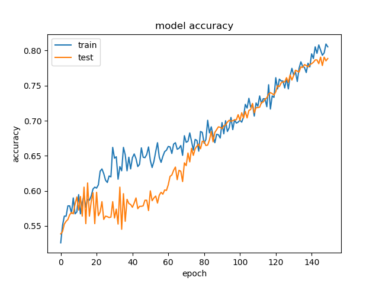
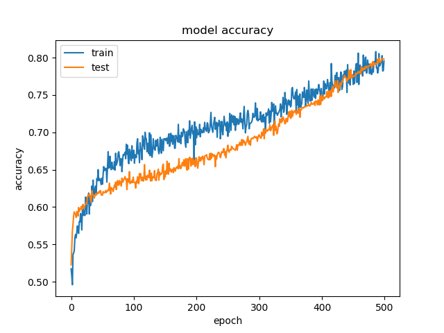
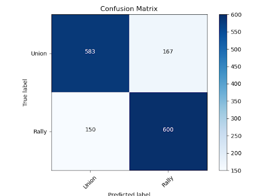
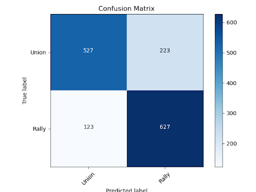
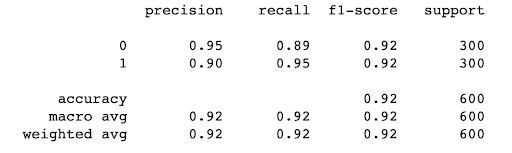
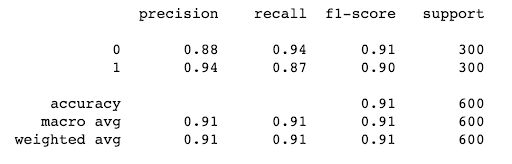
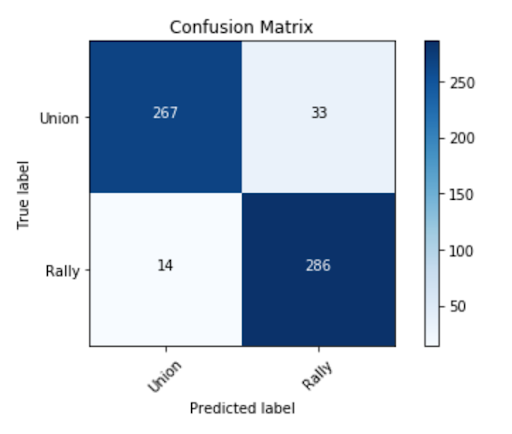
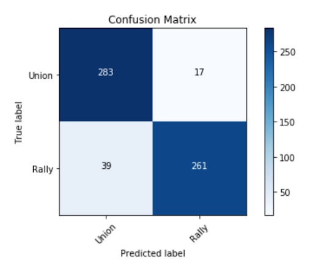

# TrumpVocabulary

**To start:**

Activate Virtual Enviroment or instal packages in `requirements.txt`

**To gather data: (If not in dir already)**

run `__init__.py` This program will open url text files in `DATA` and use `BeautifulSoup` to scrape all necessary data for each transcript. 

**To Run Model:**

Once data is collected, `run the model(s)` in `main_obama_class_model.py` and `main_trump_class_model.py`. 

Running these models will create a new folder named Trump/Obama Results. 

Both folders you will find its accuracy, loss, and confusion matrix performance. 

---

<dl>
  <dt>Inital Description:</dt>
 
  <dt>Introduction</dt>
   <dd>

U.S. presidents are known to be great orators. They routinely give rally speeches to promote upcoming elections as well as numerous addresses to the country throughout their presidential terms. When listening to some of these speeches, it appears that our presidents likely change their verbiage, tone, and style when they are addressing their supportive base when compared to how they address the country. 

<b>The goal of our project was to determine if presidents do, in fact, change the way they approach these different speeches and if so, do certain presidents adjust their speaking habits more than others? </b>

</dd>

 <dt>Dataset description: </dt>
  <dd>
  
We decided that we would use speeches from President Trump and President Obama to build our dataset. In order to create the dataset, we needed speeches that each president gave specifically to their respective base as well as speeches they gave to the entire nation. Therefore we chose to use transcripts from rally speeches and State of the Unions (SOU), respectively. Additionally, we wanted to increase the size of our dataset, so we decided to split each speech into 20 word segments and label them with a 1 (rally) or 0 (SOU) depending on where the speech segment originated from.

</dd>

 <dt>Baseline Approach: </dt>
<dd>
  
Our approach was to train a Neural Network model and Naive Bayes model on each president to see if it could easily classify a speech segment as belonging to a rally or to a SOU. Secondly, should our model achieve high accuracy results we would look closer at the details of our data to compare and contrast the speeches from the two presidents.
</dd>

---

 <dt>Logistic Regression Model: </dt>
 <dd>
  
 we built our Logistic Regression Neural Network model consisting of `five hidden layers`. Here was that accuracy and loss result when feeding Trump’s speeches and Obama’s speeches:

  <dd>
</dl>

President Obama Accuracy   |  President Trump Accuracy
:-------------------------:|:-------------------------:
  |  

<dl> </dl>

President Obama Confusion Matrix   |  President Trump Confusion Matrix
:-------------------------:|:-------------------------:
  |  

---

<dl>
   
<dt>Naive Bayes Model: </dt>
 <dd>
   
 
Our second attempt was with a Naive-Bayes model. As you’ll see in the evaluation, the default hyperparameters were all that were needed to achieve a high performance for the Naive-Bayes approach

  <dd>
</dl>

President Obama |  President Trump
:-------------------------:|:-------------------------:
  |  

<dl> </dl>

President Obama Confusion Matrix|  President Trump Confusion Matrix
:-------------------------:|:-------------------------:
  |  

<dl>
  

   
   
 
<dt>As a Result: </dt>
 <dd>
   

   Our high accuracy levels indicates that there are, in fact, distinguishable differences between the two speech categories for each respective president. 

  

Interestingly enough, the Neural Network appears to have an easier time categorizing President Obama’s speeches, while the Naive Bayes models categorize the two presidents’ speeches with an almost identical level of accuracy. Therefore, we can see that both presidents alter their speech patterns depending on their audience, but we don’t yet have enough evidence to determine which president does this in a more aggressive manner.

 
 
 
 

 
 <dt>In Conclusion: </dt>
 
-  
<b>Our Neural Network indicates a higher discrepancy in speeches for President Obama </b>

  
  
 -  
<b>The Naive Bayes model was indifferent; and our additional data analytics revealed a higher discrepancy in speeches for President Trump.</b>

  
  

<b>Therefore, our results are not conclusive enough for us to determine which leader adjusts his public speaking approach when addressing his base when compared to how he addresses the nation.</b>

  <dd>
</dl>

